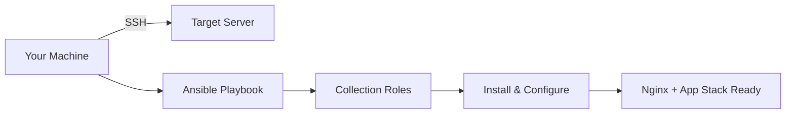

<div align="center">

# Ansible Collections

[](https://github.com/marcuwynu23/ansible-collections)
[](https://github.com/marcuwynu23/ansible-collections)
[](https://github.com/marcuwynu23/ansible-collections)
[](https://github.com/marcuwynu23/ansible-collections/issues)
[](https://github.com/marcuwynu23/ansible-collections/pulls)
[](https://github.com/marcuwynu23/ansible-collections)

This repository contains ready-to-use Ansible collections for configuring a server with a specific runtime stack. Each collection installs and configures everything needed behind an Nginx reverse proxy — so you can set up a fully functioning server with a single command.

</div>

## What is Ansible?

Ansible is an open-source automation tool that lets you configure servers, run applications, and manage infrastructure — all without installing any agent on the target machine. You write tasks in simple YAML files called **playbooks**, and Ansible connects via SSH to execute them.

Instead of manually running commands on each server, you define once what your server should look like and let Ansible do the rest.

## What is Ansible Galaxy?

[Ansible Galaxy](https://galaxy.ansible.com) is the official hub for sharing Ansible collections and roles. It works like a package manager — you can download pre-built automation content published by the community or by vendors. This repo's collections are published on Galaxy, so you can install them directly with `ansible-galaxy collection install`.

## Use Cases

These collections let you turn a blank VM or VPS into a fully configured server for your preferred runtime — whether that's for a web app, API, or backend service. Just pick the stack you need, run the playbook, and your server is ready to go. They're also great for learning how Ansible automates real-world server setup.

## How It Works



Each collection contains a playbook that calls multiple roles to install and configure everything needed for a specific tech stack.

## Available Collections

<table style="width: auto; border-collapse: collapse;">
  <thead>
    <tr style="border-bottom: 2px solid #ddd;">
      <th style="text-align:left; padding:6px 12px;">Collection</th>
      <th style="text-align:left; padding:6px 12px;">Stack</th>
      <th style="text-align:left; padding:6px 12px;">Link</th>
    </tr>
  </thead>
  <tbody>
    <tr style="border-bottom: 1px solid #eee;"><td style="padding:6px 12px;"><code>node_app_server_bootstrap</code></td><td style="padding:6px 12px;">Node.js + Nginx + PM2</td><td style="padding:6px 12px;"><a href="https://galaxy.ansible.com/ui/repo/published/marcuwynu23/node_app_server_bootstrap">galaxy</a></td></tr>
    <tr style="border-bottom: 1px solid #eee;"><td style="padding:6px 12px;"><code>dotnet_app_server_bootstrap</code></td><td style="padding:6px 12px;">.NET/C# + Nginx</td><td style="padding:6px 12px;"><a href="https://galaxy.ansible.com/ui/repo/published/marcuwynu23/dotnet_app_server_bootstrap">galaxy</a></td></tr>
    <tr style="border-bottom: 1px solid #eee;"><td style="padding:6px 12px;"><code>php_app_server_bootstrap</code></td><td style="padding:6px 12px;">PHP + PHP-FPM + Nginx</td><td style="padding:6px 12px;"><a href="https://galaxy.ansible.com/ui/repo/published/marcuwynu23/php_app_server_bootstrap">galaxy</a></td></tr>
    <tr style="border-bottom: 1px solid #eee;"><td style="padding:6px 12px;"><code>python_app_server_bootstrap</code></td><td style="padding:6px 12px;">Python + Gunicorn + Nginx</td><td style="padding:6px 12px;"><a href="https://galaxy.ansible.com/ui/repo/published/marcuwynu23/python_app_server_bootstrap">galaxy</a></td></tr>
    <tr><td style="padding:6px 12px;"><code>golang_app_server_bootstrap</code></td><td style="padding:6px 12px;">Go + Nginx</td><td style="padding:6px 12px;"><a href="https://galaxy.ansible.com/ui/repo/published/marcuwynu23/golang_app_server_bootstrap">galaxy</a></td></tr>
  </tbody>
</table>

## CI/CD

Each collection has its own GitHub Actions workflow that runs on pushes and pull requests to `main`:

| Collection | Status |
|---|---|
| `dotnet_app_server_bootstrap` | [](https://github.com/marcuwynu23/ansible-collections/actions/workflows/dotnet_app_server_bootstrap.yml) |
| `golang_app_server_bootstrap` | [](https://github.com/marcuwynu23/ansible-collections/actions/workflows/golang_app_server_bootstrap.yml) |
| `node_app_server_bootstrap` | [](https://github.com/marcuwynu23/ansible-collections/actions/workflows/node_app_server_bootstrap.yml) |
| `php_app_server_bootstrap` | [](https://github.com/marcuwynu23/ansible-collections/actions/workflows/php_app_server_bootstrap.yml) |
| `python_app_server_bootstrap` | [](https://github.com/marcuwynu23/ansible-collections/actions/workflows/python_app_server_bootstrap.yml) |

Each workflow runs two jobs:
- **syntax-check** — Installs Ansible, builds the collection, and validates both `install.yml` and `uninstall.yml` with `--syntax-check` (runs on every push/PR).
- **deploy** — Triggered manually via `workflow_dispatch`. Takes `host` and `ansible_user` as inputs; the SSH private key is read from the `SSH_PRIVATE_KEY` repository secret for security.

## Quick Start

1. Create an inventory file (`inventory.ini`) with your server IP:
   ```ini
   [webserver]
   192.168.1.10 ansible_user=root
   ```
2. Navigate to a collection folder, e.g. `cd node_app_server_bootstrap`
3. Run a playbook:
   ```bash
   ansible-playbook playbooks/<playbook>.yml -i inventory.ini
   ```

See [CONTRIBUTING.md](CONTRIBUTING.md) for detailed setup and publishing instructions.

## Running Ansible from WSL / Docker / Podman

You don't need a Linux machine to run these playbooks — any environment with Ansible installed can SSH into a remote server.

### WSL (Windows Subsystem for Linux)

```bash
# Install Ansible inside your WSL distro (Ubuntu/Debian)
sudo apt update && sudo apt install -y ansible

# Clone the repo
git clone https://github.com/marcuwynu23/ansible-collections.git
cd ansible-collections

# Run a playbook
ansible-playbook node_app_server_bootstrap/playbooks/<playbook>.yml -i inventory.ini
```

### Docker

```bash
# Run Ansible from an Alpine container with SSH access
docker run --rm -it -v ${PWD}:/workspace -w /workspace alpine:latest sh -c \
  "apk add --no-cache ansible openssh-client && sh"

# Inside the container, run:
# ansible-playbook node_app_server_bootstrap/playbooks/<playbook>.yml -i inventory.ini
```

### Podman

```bash
# Same as Docker, but with Podman
podman run --rm -it -v ${PWD}:/workspace:Z -w /workspace alpine:latest sh -c \
  "apk add --no-cache ansible openssh-client && sh"
```

## Guides

- [Contributing](CONTRIBUTING.md)
- [Code of Conduct](CODE_OF_CONDUCT.md)
- [Security](SECURITY.md)
- [License](LICENSE)
